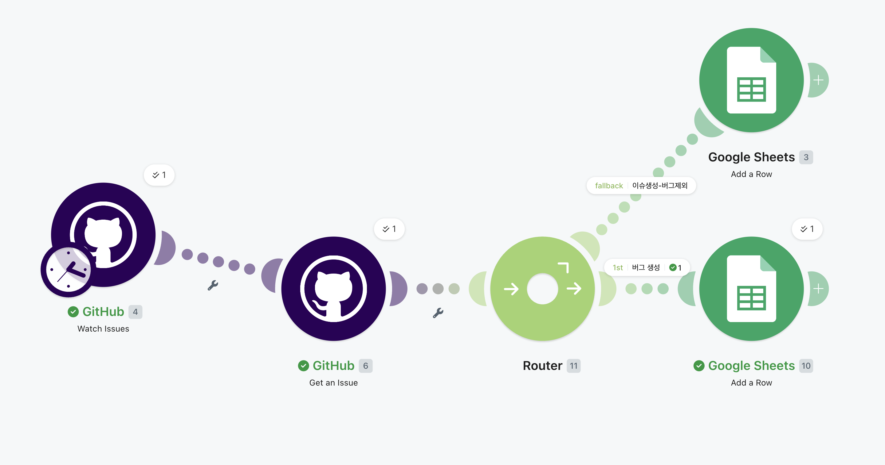
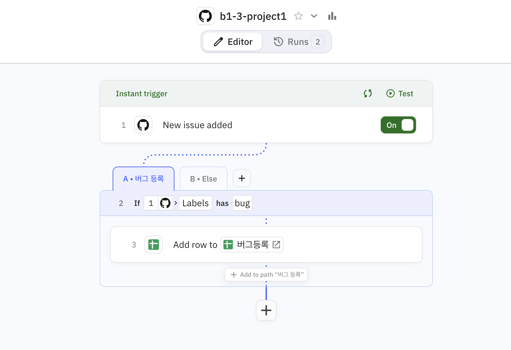
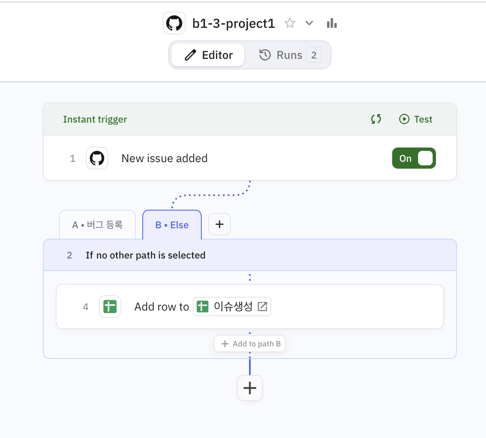

# codyssey_b1_3

코딩 없이 마우스 클릭만으로 일이 자동으로 돌아가게 만들기

## 🏆 [프로젝트 1] 자동화 도구 비교 구현

**시나리오 명:** GitHub 이슈 자동 분류 및 Google Sheets 동기화 워크플로우

**목적:** GitHub에 인입되는 이슈 중 '버그(Bug)' 유형을 필터링하여 긴급 대응 시트로 분리하고, 나머지 이슈는 일반 시트로 백업하는 이벤트 기반 자동화 파이프라인 구축.

### 🛠️ 1. Make 구현 단계 (데이터 가공 및 파싱 중심)

Make는 API 페이로드의 복잡한 배열 데이터를 파싱하고, 정교한 라우팅을 설계하는 데 강력한 장점을 보였습니다.

- **Trigger:** `GitHub - Watch Issues` (새로운 이슈 발생 이벤트 감지)
- **Action 1 (데이터 보완):** `GitHub - Get an Issue`
  - *구현 이유:* Webhook 트리거가 제공하는 요약 데이터(Label Count)의 한계를 극복하고, 이슈의 상세 GraphQL 노드 데이터를 획득하기 위해 추가 API 호출을 구성함.
- **Router (조건 분기 2가지 경로):**
  - **경로 A (버그 전용 경로):**
    - *Condition:* `{{join(map(labels.nodes; "name"); ", ")}}` 함수를 사용하여 배열(Array) 형태의 라벨 데이터를 텍스트로 평탄화한 후, `Contains` 연산자로 '버그' 또는 'bug' 키워드를 필터링함.
    - *Action:* 구글 시트 [긴급_버그 트래커]에 Title, Body, URL 추가.
  - **경로 B (일반 이슈 경로 - Fallback):**
    - *Condition:* `The fallback route`를 활성화하여, 버그 라벨이 없는 나머지 모든 이슈를 자동으로 수용(Catch-all)하도록 예외 처리 로직 최적화.
    - *Action:* 구글 시트 [전체_이슈 백업]에 데이터 추가.

### 🤝 2. [Relay.app](http://Relay.app) 구현 단계 (직관적 흐름 및 매핑 중심)

[Relay.app](http://Relay.app)은 복잡한 데이터 파싱 함수 없이도 UI 단에서 직관적인 선형 분기(Path)를 설계하는 데 압도적인 편의성을 제공했습니다.

- **Trigger:** `GitHub - New Issue`
- **Path (조건 분기 - If/Else 구조):**
  - **Path 1 (버그 전용 경로):**
    - *Condition:* GitHub 변수 목록에서 시각적으로 제공되는 `Label` 또는 `Title`을 직접 선택하고 `Contains` '버그' 조건 설정.
    - *Action:* 구글 시트 [긴급_버그 트래커]에 Add row 수행.
  - **Path 2 (일반 이슈 경로 - Otherwise):**
    - *Condition:* 기본 제공되는 `Otherwise` 경로 활용.
    - *Action:* 구글 시트 [전체_이슈 백업]에 Add row 수행.

### 📊 3. 도구 비교 분석표

|                               |                                                                 |                                                     |
| ----------------------------- | --------------------------------------------------------------- | --------------------------------------------------- |
| **비교 항목**                     | **Make**                                                        | **[Relay.app](http://Relay.app)**                   |
| **설계 방식**                     | 무한한 자유도의 2D 캔버스(노드) 기반 연결                                       | 흐름 중심의 직관적 선형(Linear) 기반 연결                         |
| **조건 분기(Branching)**          | 시각적인 Router 컴포넌트를 통해 다중 경로를 한눈에 파악하고 Fallback 설정에 유리함           | 수직적인 구조 속에서 If/Else 필터를 직관적으로 구성하는 데 유리함            |
| **데이터 조작 (Mapping)**          | `map`, `join` 등 내장 함수를 활용해 중첩된 JSON 구조를 유연하게 평탄화(Flattening) 가능 | 텍스트 파싱 자유도는 상대적으로 낮으나, UI가 구조화된 데이터를 자동으로 펼쳐주어 간결함  |
| **인간 개입 (Human-in-the-loop)** | 별도의 모듈 조합과 복잡한 설계 필요                                            | 'Approval' 기능이 기본 내장되어 결재선 등 인간 개입 워크플로우 구성이 매우 간편함 |
| **에러 및 로그 처리**                | 모듈별로 세밀한 Error Handler(Ignore/Break) 부착 가능                      | 전체 워크플로우 단위의 직관적인 실패 알림 및 재시도 제공                    |

### 4. 예제
<table>
<tr>
<th>make
[링크](https://us2.make.com/public/shared-scenario/vLwSi21F4TV/integration-git-hub-google-sheets)
</th>
</tr>
<tr>
 <td>
    

  </td>
 
  
</tr>
 <tr> 
  
  <th>relay.app
[링크](https://run.relay.app/shared/b1-3-project1-t2I2815LMzIk)
  
  </th>
</tr>
<tr>
  <td>

    
  </td>
</tr>
</table>

